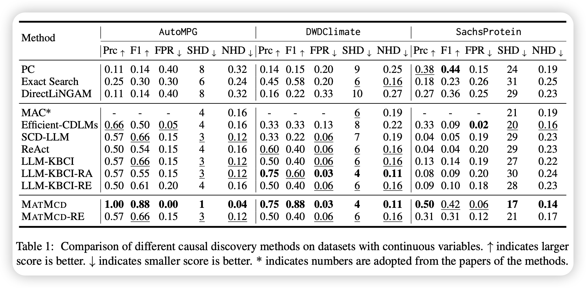
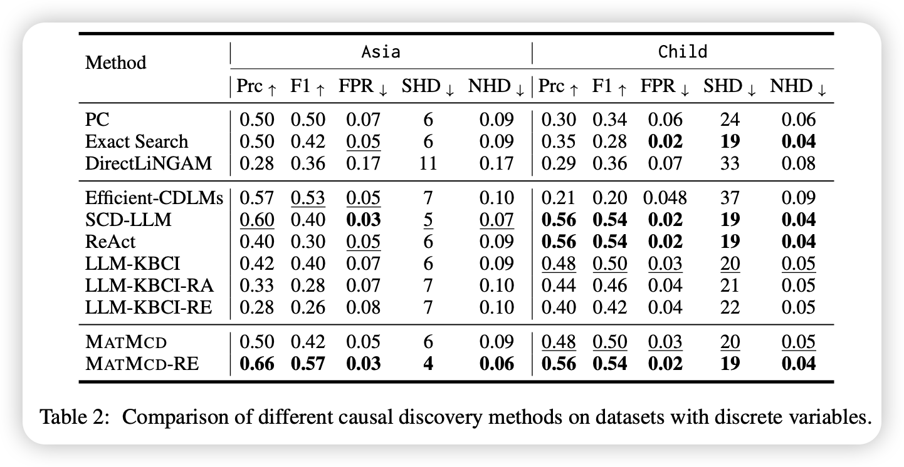

<div align="center">

# (ACL 2025 Findings) Exploring Multi-Modal Integration with Tool-Augmented LLM Agents for Precise Causal Discovery

[](https://arxiv.org/abs/2412.13667)
[](#package)
[](https://opensource.org/license/MIT)
[]()
</div>

<p align="center">
    🔍&nbsp;<a href="#about">About</a>
    | 🚀&nbsp;<a href="#quick-start">Quick Start</a>
    | 📊&nbsp;<a href="#results-and-evaluation">Evaluation</a>
    | 🔗&nbsp;<a href="#citation">Citation</a>
</p>

## 🔍About

This is the official repository for paper "[Exploring Multi-Modal Integration with Tool-Augmented LLM Agents for Precise Causal Discovery](https://arxiv.org/abs/2412.13667)". This paper proposes MATMCD (Multi-Agent with Tool-Augmented LLMs for Multi-Modality Enhanced Causal Discovery), a novel framework designed to improve causal discovery by integrating multi-modal data using tool-augmented large language model (LLM) agents.

### 🔧Framework

Traditional causal discovery methods rely solely on statistical correlations in observational data, overlooking valuable semantic cues from external sources. MATMCD addresses this gap by introducing a multi-agent system. MATMCD supports modular integration with statistical causal discovery (SCD) algorithms (e.g., PC, ES, DirectLiNGAM), and enables enhanced reasoning by combining symbolic causal graphs and unstructured textual data.

MATMCD has a architecture as illustrated in Figure 1, which consists of the following key components.
- Causal Graph Estimator: generate an initual causal graph by calling a SCD algorithm.
- Data Augmentation Agent (DA-Agent): retrieves and summarizes semantic context (e.g., from web or log data) using search tools and LLMs.
- Causal Constraint Agent (CC-Agent): integrates the augmented data with the initial causal graph to verify or refute causal links using a reasoning pipeline.
- Causal Graph Refiner: reconstructs the final causal graph by combining LLM-inferred constraints with a SCD algorithm.

<div align="center">

|[](./image/model_framework.jpg)|
|:--:|
|Figure 1: An illustration of MATMCD framework: (a) an overview of the framework, (b) the inner working of DA-Agent, and (c) the inner working of CC-Agent|
</div>


### 🔑 Key Features

  - **Multi-modal data**: integrates time series data, metadata, web documents, and logs to enrich semantic context for causal discovery. 
  - **LLM reasoning**: employs tool-augmented LLMs to reason over causal structures using external knowledge and contextual cues.
  - **Modular design**: features a modular architecture that allows easy swapping of LLMs and SCD algorithms for flexible adaptation.

## 🚀 Quick Start

1. **Clone the Repository**
   ```bash
   git clone https://github.com/your_username/MATMCD.git
   cd MATMCD
   ```

2. **Set Up the Environment**
   - We recommend using `conda` or `virtualenv` to create an isolated environment.
   ```bash
   python3 -m venv venv
   source venv/bin/activate  # or .\venv\Scripts\activate on Windows
   pip install -r requirements.txt
   ```

3. **Configure API Keys**
   - Add API-keys in `config.py` file.

4. **Download the datasets**
    - Download benchmark datasets from [AutoMPG](https://archive.ics.uci.edu/dataset/9/auto+mpg), [DWD Climate](https://webdav.tuebingen.mpg.de/cause-effect/), [Sachs](https://www.bnlearn.com/bnrepository/discrete-small.html#sachs), [Asic](https://www.bnlearn.com/bnrepository/discrete-small.html#asia), [Child](https://www.bnlearn.com/bnrepository/discrete-medium.html#child) and LEMMA_RCA datasets from [LEMMA-RCA](https://lemma-rca.github.io/).
    - Create a `data` folder and place the data in the folder.

5. **Run the Application**
    - Make sure the environment, API and dataset are accurate.
    - Run `python GTdatasets_experiment.py` to start.

6. **Run Experiments and Evaluate**
    - Run benchmark experiments on standard datasets:
      ```bash
      python GTdatasets_experiment.py
      ```
    - For root cause analysis on microservice datasets:
      ```bash
      python RCA_experiment.py
      ```
    - Results will be saved in the `results/` folder.


## 📊 Evaluation
  **MATMCD is evaluated on**:
  - **Benchmark Datasets**: AutoMPG, DWDClimate, SachsProtein, Asia, and Child — covering both time-series and sequence data.
  - **AIOps Datasets**: Product Review and Cloud Computing — large-scale multivariate time series with event logs.

  **Key results**:
  - **Up to 66.7% reduction of causal inference errors** (in terms of NHD) over baseline methods.
  - **Up to 83.3% improvement in root cause locating accuracy** (in terms of MAP@10).

<p align="center">
    
</p>

<p align="center">
    
</p>

## 🔗 Citation

```
@inproceedings{shen2025MATMCD,
  title={Exploring Multi-Modal Integration with Tool-Augmented LLM Agents for Precise Causal Discovery},
  author={Shen, ChengAo and Chen, Zhengzhang and Luo, Dongsheng and Xu, Dongkuan and Chen, Haifeng and Ni, Jingchao},
  booktitle={ACL (Findings)},
  year={2025}
}
```

## 📧 Contract

If you have any questions or concerns, please contact us: cshen9 [at] uh [dot] edu or submit an issue

